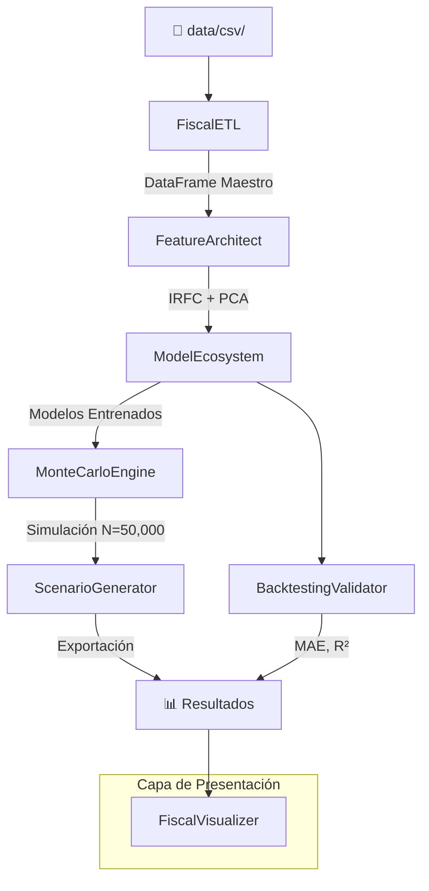

# 📉 Fiscal-Risk-BigData-Predictive-Analysis — Plan de Implementación

Sistema de ML para modelar la sostenibilidad de las finanzas públicas ecuatorianas (2025–2032), basado en la investigación de Vernaza Quiñonez.

---

## Arquitectura General



### Estructura de Archivos Propuesta

```
d:\Fiscal-Risk-BigData-Predictive-Analysis\
├── data/
│   ├── csv/                          # Datasets originales
│   └── processed/                    # Datasets procesados (salida ETL)
├── src/
│   ├── __init__.py
│   ├── config.py                     # [NEW] Constantes, rutas, configuración global
│   ├── etl/
│   │   ├── __init__.py
│   │   └── fiscal_etl.py            # [NEW] Clase FiscalETL
│   ├── features/
│   │   ├── __init__.py
│   │   └── feature_architect.py     # [NEW] Clase FeatureArchitect (IRFC + PCA)
│   ├── models/
│   │   ├── __init__.py
│   │   ├── base_model.py            # [NEW] Interfaz abstracta BaseModel
│   │   ├── hybrid_rf_arps.py        # [NEW] HybridRFArpsModel (RF + Arps)
│   │   ├── gradient_boosting.py     # [NEW] GBRevenueModel, GBDebtModel
│   │   ├── svr_reserves.py          # [NEW] SVRReservesModel
│   │   ├── kmeans_regimes.py        # [NEW] EconomicRegimeClusterer
│   │   └── model_ecosystem.py       # [NEW] ModelEcosystem (orquestador)
│   ├── simulation/
│   │   ├── __init__.py
│   │   └── monte_carlo.py           # [NEW] MonteCarloEngine
│   ├── validation/
│   │   ├── __init__.py
│   │   └── backtesting.py           # [NEW] BacktestingValidator
│   ├── scenarios/
│   │   ├── __init__.py
│   │   └── scenario_generator.py    # [NEW] ScenarioGenerator
│   └── visualization/
│       ├── __init__.py
│       └── fiscal_visualizer.py     # [NEW] FiscalVisualizer
├── main.py                          # [NEW] Punto de entrada / orquestador principal
├── requirements.txt                 # [NEW] Dependencias
└── README.md                        # [MODIFY] Actualizar estructura
```

---

## Propuesta de Cambios

### 1. Configuración Global — `src/config.py`

Centralizar todas las constantes del sistema para evitar *magic numbers* y facilitar la reproducibilidad.

#### [NEW] [config.py](file:///d:/Fiscal-Risk-BigData-Predictive-Analysis/src/config.py)

- Rutas a datasets CSV (anual y trimestral)
- Constantes del IRFC: ponderaciones `{Deuda/PIB: 0.30, R/P: 0.25, Déficit: 0.20, Empleo: 0.15, Ingresos_PGE: 0.10}`
- Parámetros PCA: `n_components=4`, `variance_threshold=0.80`
- Parámetros K-Means: `n_clusters=7`, `random_state=42`
- Parámetros Monte Carlo: `n_simulations=50_000`, umbrales de colapso
- Rangos de backtesting: `train_end=2018`, `test_start=2019`
- Parámetros Arps: rango de búsqueda para `q_i`, `λ`
- Seed global para reproducibilidad: `RANDOM_SEED=42`

---

### 2. Módulo ETL — `src/etl/fiscal_etl.py`

#### [NEW] [fiscal_etl.py](file:///d:/Fiscal-Risk-BigData-Predictive-Analysis/src/etl/fiscal_etl.py)

**Clase `FiscalETL`** — Responsabilidad Única: Extracción, Transformación y Carga de datos fiscales.

| Método | Descripción |
|--------|-------------|
| `extract_annual()` | Carga `Dataset_Macroeconomico_Ecuador_1990_2024.csv` (35 filas × 13 columnas) |
| `extract_quarterly()` | Carga `Dataset_Trimestral_Ecuador_2005_2024.csv` (80 filas × 13 columnas) |
| `_clean_data(df)` | Limpieza: manejo de nulos (interpolación lineal/forward-fill), detección de outliers (IQR), normalización de nombres de columnas |
| `_chowlin_disaggregate()` | Desagregación temporal Chow-Lin: convierte series anuales (1990–2004) a trimestrales usando los indicadores del dataset trimestral 2005+ como guía. Utiliza la librería `tempdisagg` |
| `_harmonize_series()` | Armoniza las series desagregadas (1990–2004 Q) con las trimestrales originales (2005–2024 Q) en un único DataFrame coherente |
| `build_master_dataframe()` | Pipeline completo ETL → devuelve DataFrame maestro (≈140 filas trimestrales × 13+ columnas) |

**Lógica Chow-Lin:** Para cada variable anual (1990–2004), se usa como indicador de alta frecuencia la propia serie trimestral 2005–2024 extrapolada hacia atrás, o alternativamente una tendencia lineal cuando no hay indicador disponible.

---

### 3. Ingeniería de Características — `src/features/feature_architect.py`

#### [NEW] [feature_architect.py](file:///d:/Fiscal-Risk-BigData-Predictive-Analysis/src/features/feature_architect.py)

**Clase `FeatureArchitect`** — Responsabilidad Única: Transformación de features e índices compuestos.

| Método | Descripción |
|--------|-------------|
| `compute_irfc(df)` | Calcula el Índice de Riesgo Fiscal Compuesto (0–100) con normalización min-max y ponderaciones: Deuda/PIB (30%), R/P (25%), Déficit (20%), Empleo (15%), Ingresos PGE (10%) |
| `apply_pca(df)` | PCA sobre las 12 variables originales → 4 componentes principales (>80% varianza explicada). Usa `sklearn.decomposition.PCA` |
| `get_pca_loadings()` | Retorna la matriz de cargas factoriales para interpretar los ejes (Petróleo-PIB vs Deuda-Déficit) |
| `transform(df)` | Pipeline completo: IRFC + PCA → DataFrame aumentado listo para modelado |

**Fórmula IRFC:**
```
IRFC = 0.30 × norm(Deuda/PIB) + 0.25 × norm(1/Ratio_RP) + 0.20 × norm(Déficit) 
     + 0.15 × norm(1 - Empleo) + 0.10 × norm(1 - Ingresos_PGE)
```
> Donde `norm()` aplica escalado min-max [0,1] y las inversiones aseguran que mayor riesgo = mayor valor.

---

### 4. Ecosistema de Modelos — `src/models/`

#### [NEW] [base_model.py](file:///d:/Fiscal-Risk-BigData-Predictive-Analysis/src/models/base_model.py)

**Clase Abstracta `BaseModel(ABC)`** — Define la interfaz común (Principio de Sustitución de Liskov):

```python
class BaseModel(ABC):
    @abstractmethod
    def fit(self, X: pd.DataFrame, y: pd.Series) -> 'BaseModel': ...
    
    @abstractmethod
    def predict(self, X: pd.DataFrame) -> np.ndarray: ...
    
    @abstractmethod
    def get_metrics(self) -> Dict[str, float]: ...
    
    @abstractmethod
    def get_model_name(self) -> str: ...
```

---

#### [NEW] [hybrid_rf_arps.py](file:///d:/Fiscal-Risk-BigData-Predictive-Analysis/src/models/hybrid_rf_arps.py)

**Clase `HybridRFArpsModel(BaseModel)`** — Modelo híbrido 50% Random Forest + 50% Ecuación de Arps.

- **Random Forest:** `n_estimators=200`, `max_depth=8`, features = variables macroeconómicas
- **Arps Exponencial:** $q(t) = q_i \cdot e^{-\lambda t}$ — parámetros ajustados con `scipy.optimize.curve_fit`
- **Combinación:** `prediction = 0.5 × RF_pred + 0.5 × Arps_pred`
- **Target:** Producción Diaria (Kb/d)

---

#### [NEW] [gradient_boosting.py](file:///d:/Fiscal-Risk-BigData-Predictive-Analysis/src/models/gradient_boosting.py)

**Clases `GBRevenueModel(BaseModel)` y `GBDebtModel(BaseModel)`** — Gradient Boosting optimizados.

- `GBRevenueModel`: Target = Recaudación IVA + Ingresos Petroleros (proxy de ingresos fiscales)
- `GBDebtModel`: Target = Deuda/PIB (%)
- Hiperparámetros: `n_estimators=300`, `learning_rate=0.05`, `max_depth=5`, `subsample=0.8`
- Validación con GridSearchCV (3-fold temporal)

---

#### [NEW] [svr_reserves.py](file:///d:/Fiscal-Risk-BigData-Predictive-Analysis/src/models/svr_reserves.py)

**Clase `SVRReservesModel(BaseModel)`** — SVR con kernel RBF para agotamiento de reservas.

- Target = Reservas Probadas (Mb)
- Kernel RBF con `C` y `gamma` optimizados
- Escalar features con `StandardScaler`

---

#### [NEW] [kmeans_regimes.py](file:///d:/Fiscal-Risk-BigData-Predictive-Analysis/src/models/kmeans_regimes.py)

**Clase `EconomicRegimeClusterer`** — K-Means para identificación de regímenes históricos.

- `n_clusters=7` (según investigación de Vernaza Quiñonez)
- Features: componentes PCA (4 dimensiones)
- Salida: etiquetas de clúster + centroides + análisis de silhouette
- Interpretación de cada régimen (boom petrolero, crisis, dolarización, etc.)

---

#### [NEW] [model_ecosystem.py](file:///d:/Fiscal-Risk-BigData-Predictive-Analysis/src/models/model_ecosystem.py)

**Clase `ModelEcosystem`** — Orquestador que entrena y gestiona los 8 modelos del ecosistema.

- Registra modelos siguiendo el Principio Open/Closed (se pueden añadir nuevos modelos sin modificar la clase)
- Método `train_all()` → entrena todos los modelos registrados
- Método `predict_all(X)` → genera predicciones consolidadas
- Método `export_models()` → serialización con `joblib`

---

### 5. Motor de Simulación — `src/simulation/monte_carlo.py`

#### [NEW] [monte_carlo.py](file:///d:/Fiscal-Risk-BigData-Predictive-Analysis/src/simulation/monte_carlo.py)

**Clase `MonteCarloEngine`** — Simulación estocástica con N=50,000 iteraciones.

| Parámetro Estocástico | Símbolo | Distribución |
|------------------------|---------|--------------|
| Tasa de declive petrolero | δ | Normal(μ=0.03, σ=0.01) |
| Precio del crudo | W | LogNormal ajustada a históricos |
| Crecimiento PIB | γ | Normal(μ=1.5%, σ=2.0%) |

**Lógica de Colapso Fiscal:**
```
Score = Σ(indicadores binarios) donde cada indicador vale 1 si:
  - Deuda/PIB > 80%
  - Ratio R/P < 5 años
  - Déficit > 8% PIB
  - Producción < 300 Kb/d
  - IRFC > 75
  - Empleo < 30%
  - Reservas < 500 Mb

Colapso = Score ≥ 5
```

- Método `run_simulation()` → retorna distribución de scores y probabilidad de colapso
- Método `compute_fiscal_traffic_light()` → Semáforo Fiscal (Verde/Amarillo/Rojo)

---

### 6. Validación — `src/validation/backtesting.py`

#### [NEW] [backtesting.py](file:///d:/Fiscal-Risk-BigData-Predictive-Analysis/src/validation/backtesting.py)

**Clase `BacktestingValidator`** — Validación retrospectiva rigurosa.

- Split temporal: Train (1990–2018) vs Test (2019–2024)
- Métricas: MAE, R², RMSE, MAPE por modelo
- Walk-forward validation para series temporales
- Método `generate_validation_report()` → DataFrame con métricas consolidadas

---

### 7. Generador de Escenarios — `src/scenarios/scenario_generator.py`

#### [NEW] [scenario_generator.py](file:///d:/Fiscal-Risk-BigData-Predictive-Analysis/src/scenarios/scenario_generator.py)

**Clase `ScenarioGenerator`** — Exportación de proyecciones 2025–2032.

| Escenario | Precio Crudo | Crecimiento PIB | Declive Producción |
|-----------|-------------|-----------------|-------------------|
| **Optimista** | $75/bbl | 3.0% | -2.0%/año |
| **Base** | $60/bbl | 1.5% | -3.5%/año |
| **Pesimista** | $40/bbl | 0.0% | -5.0%/año |

- Método `generate_projections()` → DataFrame con proyecciones por escenario y año
- Método `export_to_csv()` → Exportación a CSV
- Método `compute_collapse_probabilities()` → Probabilidad de colapso por escenario

---

### 8. Visualización — `src/visualization/fiscal_visualizer.py`

#### [NEW] [fiscal_visualizer.py](file:///d:/Fiscal-Risk-BigData-Predictive-Analysis/src/visualization/fiscal_visualizer.py)

**Clase `FiscalVisualizer`** — Separación estricta de lógica de presentación (SRP).

- `plot_irfc_evolution()` → Evolución temporal del IRFC con semáforo
- `plot_pca_clusters()` → Scatter PCA 2D con colores por régimen K-Means
- `plot_production_forecast()` → Proyección de producción (RF+Arps) con bandas de confianza
- `plot_monte_carlo_distribution()` → Histograma de scores de colapso
- `plot_scenario_comparison()` → Panel comparativo de escenarios
- `plot_backtesting_results()` → Predicho vs Real con bandas de error

---

### 9. Punto de Entrada — `main.py`

#### [NEW] [main.py](file:///d:/Fiscal-Risk-BigData-Predictive-Analysis/main.py)

Orquestador principal que ejecuta el pipeline completo:

```
1. ETL → DataFrame Maestro
2. Feature Engineering → IRFC + PCA
3. Backtesting Validation → Métricas
4. Model Training → Ecosistema completo
5. Monte Carlo Simulation → Probabilidad de colapso
6. Scenario Generation → Proyecciones 2025–2032
7. Visualization → Gráficos exportados
```

---

### 10. Dependencias — `requirements.txt`

#### [NEW] [requirements.txt](file:///d:/Fiscal-Risk-BigData-Predictive-Analysis/requirements.txt)

```
pandas>=2.0
numpy>=1.24
scikit-learn>=1.3
scipy>=1.11
matplotlib>=3.7
seaborn>=0.12
joblib>=1.3
tempdisagg>=1.0
```

---

## Principios de Diseño Aplicados

| Principio SOLID | Aplicación |
|----------------|------------|
| **S** — Single Responsibility | Cada clase tiene una única responsabilidad (ETL, Features, Modelo, Simulación, Visualización) |
| **O** — Open/Closed | `ModelEcosystem` acepta nuevos modelos sin modificarse, vía `register_model()` |
| **L** — Liskov Substitution | Todos los modelos implementan `BaseModel` y son intercambiables |
| **I** — Interface Segregation | `BaseModel` define solo los métodos esenciales; K-Means no implementa `fit/predict` estándar |
| **D** — Dependency Inversion | Los módulos superiores dependen de abstracciones (`BaseModel`), no de clases concretas |

## Restricciones de Calidad

- **Type Hinting** exhaustivo en todas las firmas de métodos y atributos
- **Logging** con `logging` estándar de Python (niveles INFO, WARNING, ERROR) en cada etapa
- **Docstrings Google-style** en todas las clases y métodos públicos
- **Comentarios** que relacionan cada módulo con los hallazgos del artículo de Vernaza Quiñonez

---

## Plan de Verificación

### Ejecución Automatizada
1. `pip install -r requirements.txt` — Instalar dependencias
2. `python main.py` — Ejecutar pipeline completo
3. Verificar que:
   - ETL genera DataFrame maestro sin nulos (≈140 filas × 15+ columnas)
   - PCA explica >80% de varianza con 4 componentes
   - K-Means identifica 7 clústeres con silhouette > 0.3
   - Backtesting reporta MAE y R² para cada modelo
   - Monte Carlo ejecuta 50,000 iteraciones y reporta P(colapso)
   - Escenarios Optimista/Base/Pesimista se exportan a CSV

### Validación de Salidas
- Archivos generados en `data/processed/` y `output/`
- Gráficos generados en `output/plots/`
- Logs de ejecución en consola con trazabilidad completa

---

> [!IMPORTANT]
> **Decisión de diseño:** Se implementará una desagregación Chow-Lin simplificada usando regresión con restricciones de agregación temporal, dado que la librería `tempdisagg` puede no estar disponible en todas las plataformas. Se incluirá un fallback a interpolación cúbica.

> [!NOTE]
> Los datasets ya están cargados en `data/csv/`. El dataset anual tiene 35 años (1990–2024) y el trimestral 80 trimestres (2005–2024). Las columnas son idénticas en ambos datasets, facilitando la armonización.
